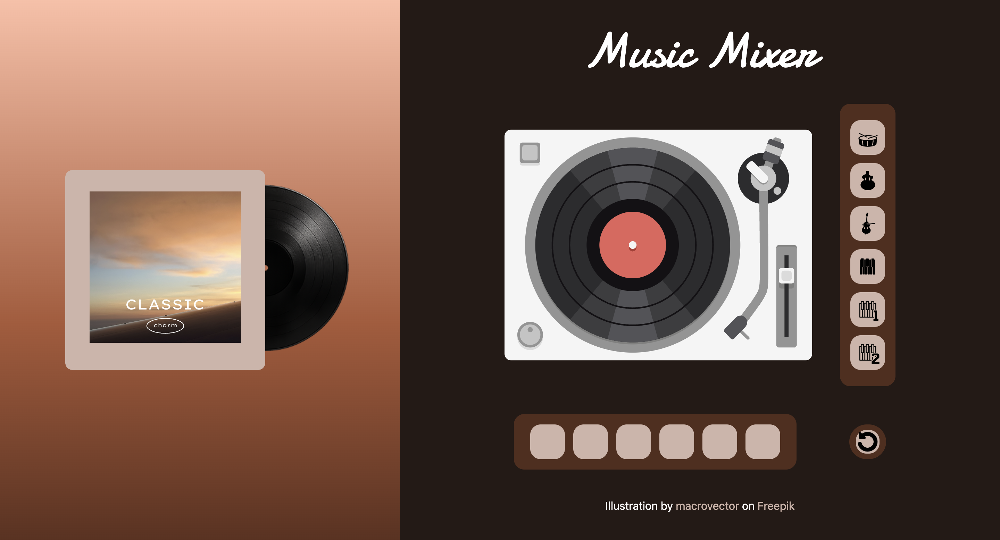

# Music Mixer Project

This project is an interactive virtual record player that allows users to create their own music by dragging and dropping instrument icons to the dropping zone.

## **Key Features**
* Drag and drop instruments into dropping zones

* Play the sounds of each instrument

* Animate vinyl spinning and tonearm movement 

* Able to click on each instruments to return it back in the their original position and pause the sound

* Reset button to reload the entire experience

## **Technologies Used**
* HTML, CSS, JavaScript
* SVG for interactive animations
* Tailwind CSS

## **How to Use**
* Open project by Vscode

* Install Live Server extention and click to Go Live to open project on browser

* Drag an instrument image and drop it onto the record player

* The vinyl will start spinning and play the associated sound

* Click an instrument to return it 

* Use the reset button to clear the board and start again

## **Screenshots**
Here is a sample of the music mixer project UI:

## **History**
Created on February 11, 2025

## **Credits**
1. Chanya Chumdee
2. Qihong Liu

## **License**
MIT